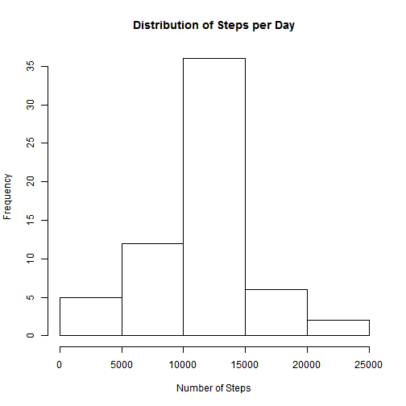

# Reproducible Research: Peer Assessment 1
==========================================

##Loading and Preprocessing the Data

Load the data from the CSV file, and assign the data types for each column.


```r
data<-read.csv("activity.csv", colClasses = c("numeric", "Date", "numeric"))
```

Understand the compositon of the data using 

```r
summary(data)
```

```
##      steps            date               interval   
##  Min.   :  0.0   Min.   :2012-10-01   Min.   :   0  
##  1st Qu.:  0.0   1st Qu.:2012-10-16   1st Qu.: 589  
##  Median :  0.0   Median :2012-10-31   Median :1178  
##  Mean   : 37.4   Mean   :2012-10-31   Mean   :1178  
##  3rd Qu.: 12.0   3rd Qu.:2012-11-15   3rd Qu.:1766  
##  Max.   :806.0   Max.   :2012-11-30   Max.   :2355  
##  NA's   :2304
```

```r
str(data)
```

```
## 'data.frame':	17568 obs. of  3 variables:
##  $ steps   : num  NA NA NA NA NA NA NA NA NA NA ...
##  $ date    : Date, format: "2012-10-01" "2012-10-01" ...
##  $ interval: num  0 5 10 15 20 25 30 35 40 45 ...
```

From this once can observe that there are NAs in steps. 

##What is mean total number of steps taken per day?

To calculate total steps per day and then change the name of the columns.

```r
totalsteps<-aggregate(steps~date,data=data,FUN=sum)
```

To plot the histogram:

```r
hist(totalsteps$steps, ylab="Frequency", xlab="Number of Steps", main="Distribution of Steps per Day")
```

 

To find the mean:

```r
mean(totalsteps$steps)
```

```
## [1] 10766
```

To find the media:

```r
median(totalsteps$steps)
```

```
## [1] 10765
```


##What is the average daily activity pattern?

To calculate the average number of steps on 5 minute interval.


```r
interval <- aggregate(steps~interval,data=data,FUN=mean)
plot(interval, type='l', main="Average number of steps at 5 min interval")
```

 

The interval with the highest value can be found by finding the maximum steps value.

```r
interval[which.max(interval$steps),]$interval
```

```
## [1] 835
```

##Imputing missing values


The number of NAs in steps are:

```r
sum(is.na(data$steps))
```

```
## [1] 2304
```

The NAs will be replaced with the mean number of steps based on the same interval value.

First the mean of the steps which was calculated will me merged with the original data set. 
They will be merged using the interval value. Then each NA value will be replaced by the mean 
of the steps with the same interval.


```r
joined <- merge(data,interval, by="interval")
joined$steps.x[is.na(joined$steps.x)]<-joined$steps.y[is.na(joined$steps.x)]
joined <- joined[,c(1,2,3)]
```

Find total again and then plot the histogram with replaced values:

```r
totalsteps2<-aggregate(steps.x~date,data=joined,FUN=sum)
hist(totalsteps2$steps.x, ylab="Frequency", xlab="Number of Steps", main="Distribution of Steps per Day")
```

 

To find the mean:

```r
mean(totalsteps2$steps.x)
```

```
## [1] 10766
```

To find the media:

```r
median(totalsteps2$steps.x)
```

```
## [1] 10766
```

Overall the difference between the first set of data (NAs included) and the second set (NAs replaced) is very little:

```r
mean(totalsteps$steps)-mean(totalsteps2$steps.x)
```

```
## [1] 0
```

```r
median(totalsteps$steps)-median(totalsteps2$steps.x)
```

```
## [1] -1.189
```

##Are there differences in activity patterns between weekdays and weekends?

First a function is created to check if it's a weekend or a weekday. Then each data is checked, and it's type is appened to the dataframe.


```r
checkday <- function(x) {
  if (weekdays(as.Date(x,format='%d-%m-%Y')) %in% c('Saturday','Sunday'))
    "Weekend"
  else
    "Weekday"
}

joined$type<-as.factor(sapply(joined$date,checkday))
```

The charts are created to compare the weekends with the weekdays.


```r
library(ggplot2)
res<-aggregate(joined$steps.x,by=list(joined$interval,joined$type),mean)
names(res)<-c("interval","type","mean")
par(mfrow=c(2,1))
g<-ggplot(res,aes(interval,mean))
g+geom_line()+facet_grid(type~.)
```

 
